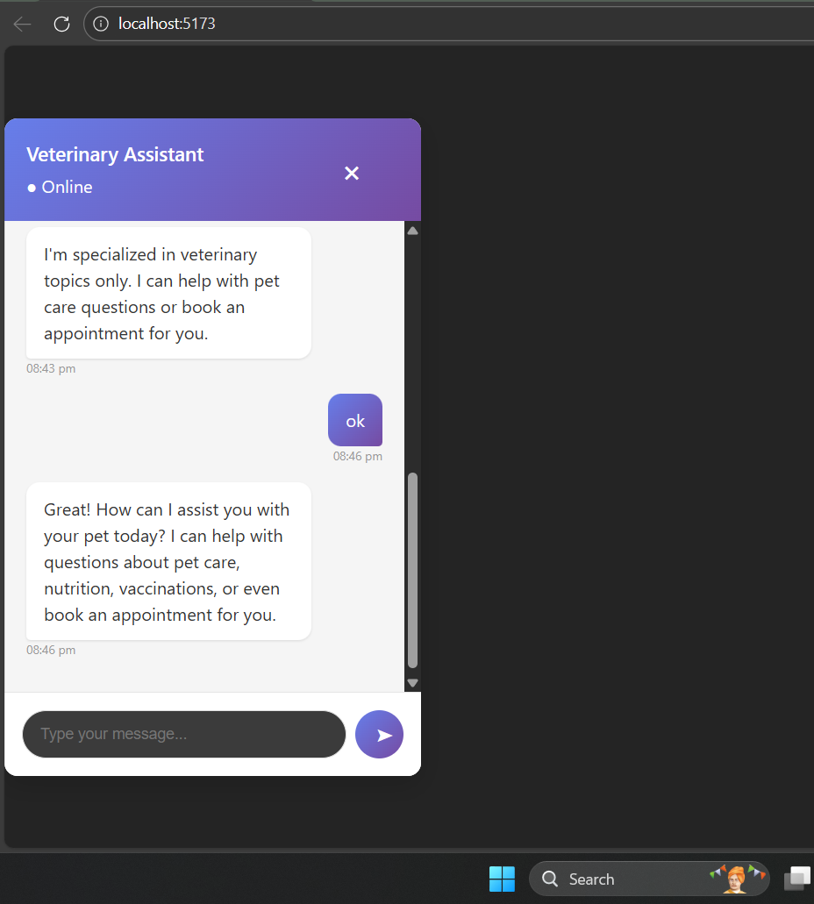

# Quick Start
Prerequisites

Node.js (v18 or higher)
MongoDB (local or cloud instance)
Google Gemini API key (Get it here)

Backend Setup
bash# Navigate to backend directory
cd backend

# Install dependencies
npm install

# Create environment file
cp .env.example .env

# Edit .env with your credentials
nano .env

# Start the server
npm run dev
Frontend Setup
bash# Navigate to frontend directory
cd frontend

# Install dependencies
npm install

# Create environment file
cp .env.example .env

# Start development server
npm run dev

# Environment Configuration

Backend (.env)
PORT=5000
MONGODB_URI=mongodb://localhost:27017/vet-chatbot
GEMINI_API_KEY=your_gemini_api_key_here
FRONTEND_URL=http://localhost:5173
NODE_ENV=development

Frontend (.env)

VITE_API_URL=http://localhost:5000/api

## Chat UI

